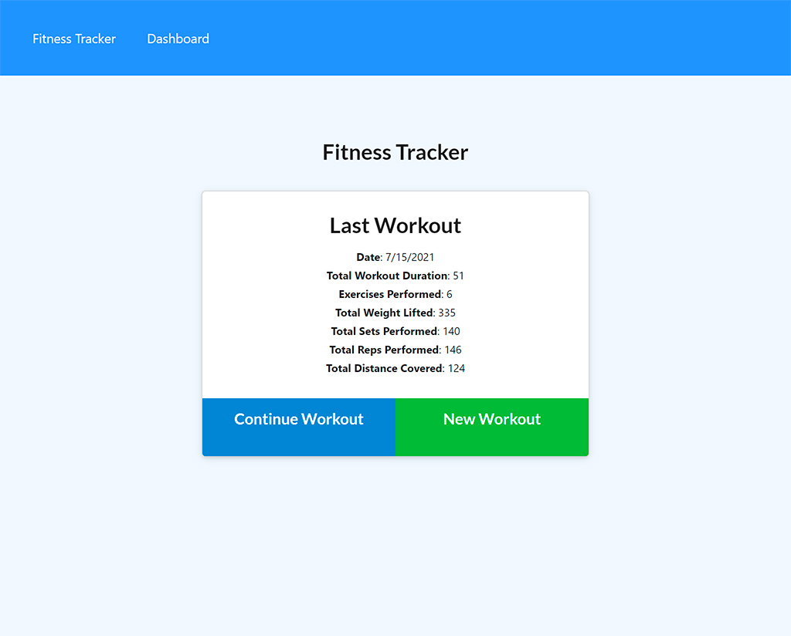
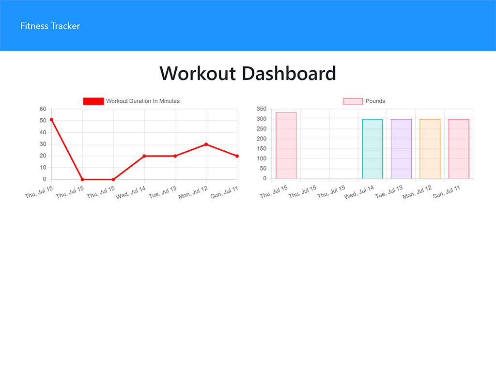
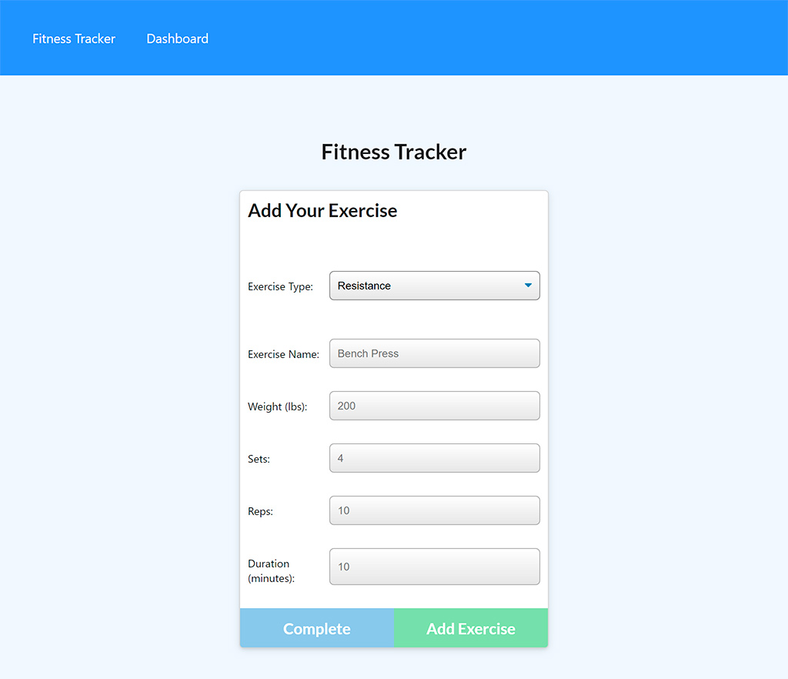

# Workout Tracker

## Description
This application allows you to view, create and track your daily workout. When the user loads the page, they see information about latest workout and the options to create a new workout or continue with their last workout. The user can add one or more exercise to current or new workout. On the dashboard page, the user can track workouts data for the last 7 days.

## Installation
To be able to use the application you need to install the necessary `npm modules`. You can do this by running the command 

```bash
npm install
```

in the root folder of the project.

You should add configuration data `.env` file about your database connection to run application localy. File structure:

```
MONGODB_URI='mongodb://localhost/yourDatabaseName'
```

For adding test data to database you can run the command:

```bash
npm run seed
```

## Usage
To run application localy use this command from root folder:

```bash
npm start
```

After launch, the local application will be available via the link - http://localhost:3000/.

## Previews
Home page:



Dashboard page:



Adding exercise to current workout:



## Credits
Author [Oleksandr Kulyk](https://github.com/AlexKuWerz)

Packages used:
- [Express.js](https://www.npmjs.com/package/express)
- [Mongoose](https://www.npmjs.com/package/mongoose)
- [Morgan](https://www.npmjs.com/package/morgan)
- [Dotenv](https://www.npmjs.com/package/dotenv)
